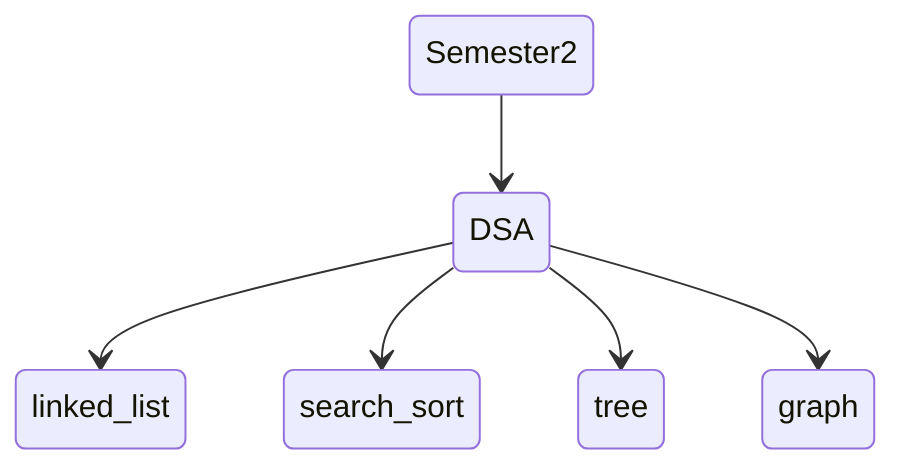
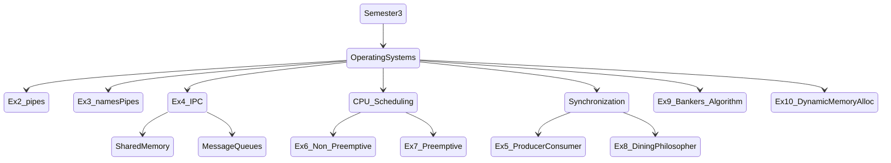

# LabSolutions

## Semester 2

```mermaid
stateDiagram-v2
    Semester2 --> DSA
    DSA --> linked_list
    DSA --> search_sort
    DSA --> tree
    DSA --> graph
```
 

## Semester 3
- Refer respective folder to find questions in PDF format.

```mermaid
stateDiagram-v2
    Semester3 --> OperatingSystems
    OperatingSystems --> Ex2_pipes
    OperatingSystems --> Ex3_namesPipes
    OperatingSystems --> Ex4_IPC
    Ex4_IPC --> SharedMemory
    Ex4_IPC --> MessageQueues
    OperatingSystems --> CPU_Scheduling
    CPU_Scheduling --> Ex6_Non_Preemptive
    CPU_Scheduling --> Ex7_Preemptive
    OperatingSystems --> Synchronization
    Synchronization --> Ex5_ProducerConsumer
    Synchronization --> Ex8_DiningPhilosopher
    OperatingSystems --> Ex9_Bankers_Algorithm
    OperatingSystems --> Ex10_DynamicMemoryAlloc
```

